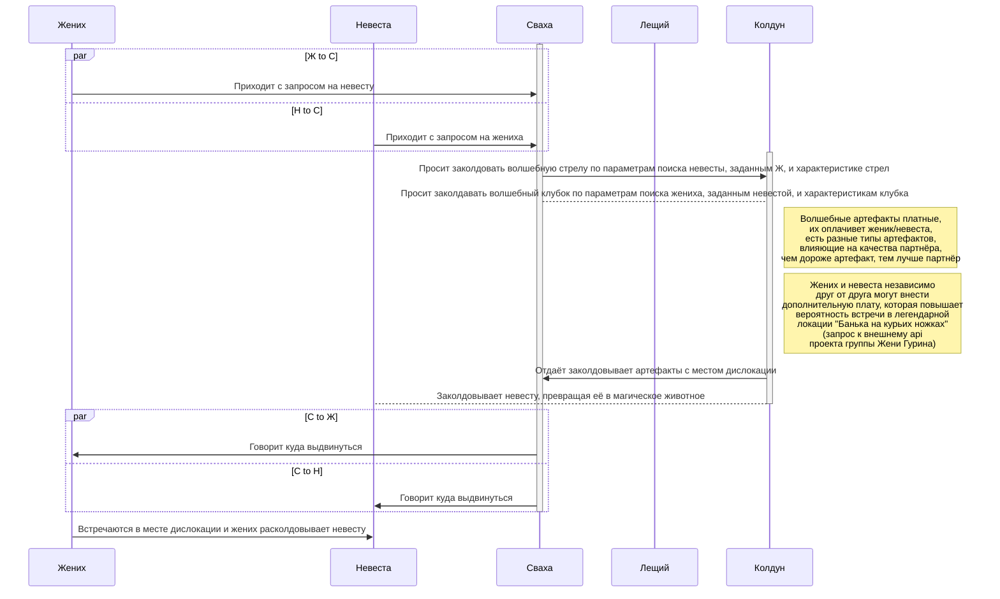

# Старославянский Тиндер вдохновлённый сказкой "Царевна-лягушка"

## Акторы:
1. Женихи *(Ж)*
2. Невесты *(Н)*
3. Свахи *(С)*
4. Лещий *(Л)*
5. Колдун *(К)*

## Диаграмма последовательности:

```mermaid
sequenceDiagram
    participant Ж as Жених
    participant Н as Невеста
    participant С as Сваха
    participant Л as Лещий
    participant К as Колдун
    activate С
    par Ж to С
        Ж->>С: Приходит с запросом на невесту
    and Н to С
        Н->>С: Приходит с запросом на жениха
    end
    activate К
    С->>К: Просит заколдовать волшебную стрелу по параметрам поиска невесты, заданным Ж, и характеристике стрел
    С --> К: Просит заколдавать волшебный клубок по параметрам поиска жениха, заданным невестой, и характеристикам клубка
    note right of К: Волшебные артефакты платные, <br> их оплачивет женик/невеста, <br> есть разные типы артефактов, <br> влияющие на качества партнёра, <br> чем дороже артефакт, тем лучше партнёр
    note right of К: Жених и невеста независимо <br> друг от друга могут внести <br> дополнительную плату, которая повышает <br> вероятность встречи в легендарной <br> локации "Банька на курьих ножках" <br> (запрос к внешнему api <br> проекта группы Жени Гурина)
    К->>С: Отдаёт заколдовывает артефакты с местом дислокации
    К-->Н: Заколдовывает невесту, превращая её в магическое животное
    deactivate К
    par С to Ж
        С->>Ж: Говорит куда выдвинуться
    and С to Н
        С->>Н: Говорит куда выдвинуться
    end
    deactivate С
    Ж->>Н: Встречаются в месте дислокации и жених расколдовывает невесту
```